# Critical Sequence Diagrams

**Status:** Accepted  
**Scope:** Authentication & Lifecycle (Implemented) and General-Admission Ticketing Pipeline (Planned)

---

## Part 1: Implemented Workflows

### Registration Challenge Request

User submits an email address. The system validates the input, checks cooldowns, persists an unauthenticated challenge, and queues an outbox event.

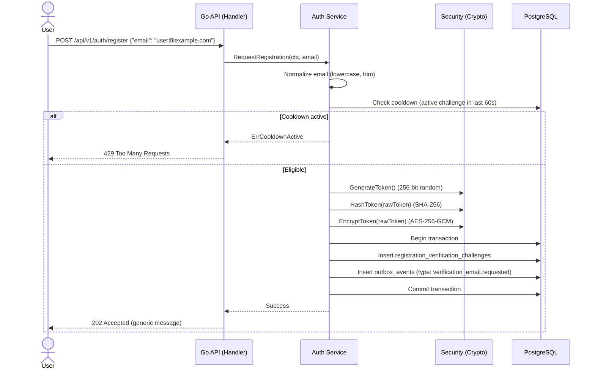
```mermaid
sequenceDiagram
    actor U as User
    participant API as Go API (Handler)
    participant S as Auth Service
    participant SEC as Security (Crypto)
    participant DB as PostgreSQL

    U->>API: POST /api/v1/auth/register {"email": "user@example.com"}
    API->>S: RequestRegistration(ctx, email)
    S->>S: Normalize email (lowercase, trim)
    S->>DB: Check cooldown (active challenge in last 60s)

    alt Cooldown active
        S-->>API: ErrCooldownActive
        API-->>U: 429 Too Many Requests

    else Eligible
        S->>SEC: GenerateToken() (256-bit random)
        S->>SEC: HashToken(rawToken) (SHA-256)
        S->>SEC: EncryptToken(rawToken) (AES-256-GCM)
        S->>DB: Begin transaction
        S->>DB: Insert registration_verification_challenges
        S->>DB: Insert outbox_events (type: verification_email.requested)
        S->>DB: Commit transaction
        S-->>API: Success
        API-->>U: 202 Accepted (generic message)
    end
```

**Design details:**

- Endpoint: `POST /api/v1/auth/register`.
- Rate limiting: 60-second cooldown per email address.
- Token generation: 256 bits of cryptographically secure entropy.
- Raw token is never stored in plaintext: only the SHA-256 hash is in the challenge table, while the outbox payload holds an AES-256-GCM encrypted token.

---

### Outbox Processing and Verification Email Delivery

The worker process leases batches of pending outbox events, decrypts tokens, delivers emails via SMTP, and records outcomes.

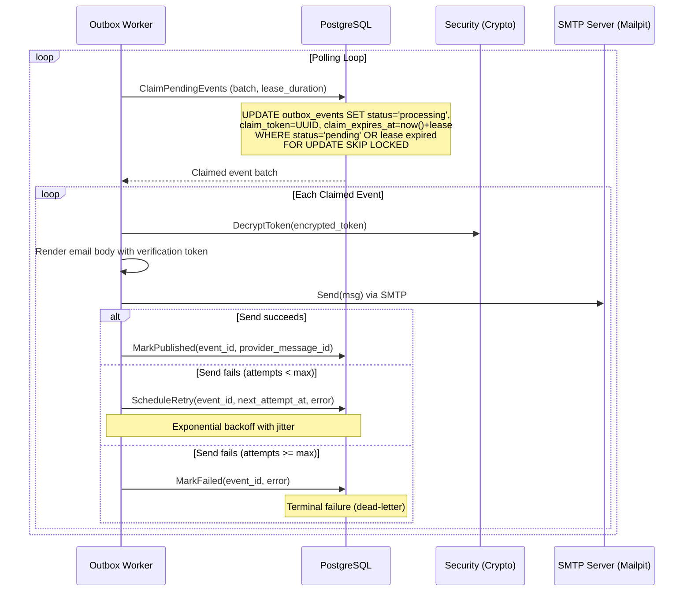
```mermaid
sequenceDiagram
    participant W as Outbox Worker
    participant DB as PostgreSQL
    participant SEC as Security (Crypto)
    participant SMTP as SMTP Server (Mailpit)

    loop Polling Loop
        W->>DB: ClaimPendingEvents (batch, lease_duration)
        Note over DB: UPDATE outbox_events SET status='processing',<br/>claim_token=UUID, claim_expires_at=now()+lease<br/>WHERE status='pending' OR lease expired<br/>FOR UPDATE SKIP LOCKED
        DB-->>W: Claimed event batch

        loop Each Claimed Event
            W->>SEC: DecryptToken(encrypted_token)
            W->>W: Render email body with verification token
            W->>SMTP: Send(msg) via SMTP

            alt Send succeeds
                W->>DB: MarkPublished(event_id, provider_message_id)
            else Send fails (attempts < max)
                W->>DB: ScheduleRetry(event_id, next_attempt_at, error)
                Note over W,DB: Exponential backoff with jitter
            else Send fails (attempts >= max)
                W->>DB: MarkFailed(event_id, error)
                Note over DB: Terminal failure (dead-letter)
            end
        end
    end
```

**Design details:**

- Concurrency: Multiple workers use `SKIP LOCKED` and leases (`claim_token`, `claim_expires_at`) to safely claim disjoint batches.
- Fault tolerance: Expired leases are automatically reclaimed.
- Retries: Exponential backoff with full jitter up to 5 attempts before terminal `failed` marking.
- Delivery: Local development and tests use Mailpit over SMTP per ADR-013.

---

### Registration Completion

Customer submits the raw token from the email, a password, and a display name. The challenge is atomically verified and consumed, and the user account is created.

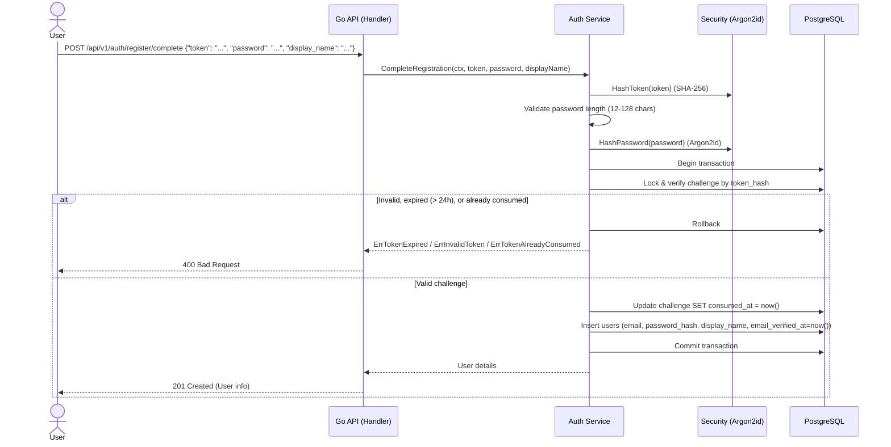
```mermaid
sequenceDiagram
    actor U as User
    participant API as Go API (Handler)
    participant S as Auth Service
    participant SEC as Security (Argon2id)
    participant DB as PostgreSQL

    U->>API: POST /api/v1/auth/register/complete {"token": "...", "password": "...", "display_name": "..."}
    API->>S: CompleteRegistration(ctx, token, password, displayName)
    S->>SEC: HashToken(token) (SHA-256)
    S->>S: Validate password length (12-128 chars)
    S->>SEC: HashPassword(password) (Argon2id)
    S->>DB: Begin transaction
    S->>DB: Lock & verify challenge by token_hash

    alt Invalid, expired (> 24h), or already consumed
        S->>DB: Rollback
        S-->>API: ErrTokenExpired / ErrInvalidToken / ErrTokenAlreadyConsumed
        API-->>U: 400 Bad Request

    else Valid challenge
        S->>DB: Update challenge SET consumed_at = now()
        S->>DB: Insert users (email, password_hash, display_name, email_verified_at=now())
        S->>DB: Commit transaction
        S-->>API: User details
        API-->>U: 201 Created (User info)
    end
```

**Design details:**

- Endpoint: `POST /api/v1/auth/register/complete`.
- Email-first registration: Accounts are created only after verification.
- Passwords are hashed using Argon2id with memory-hard parameters.
- Single-use challenge: Guaranteed by atomic `consumed_at` check and row locking.

---

### Login and Session Creation

Customer authenticates with email and password. Upon successful Argon2id verification, a stateful session is persisted and a secure HTTP cookie is issued.

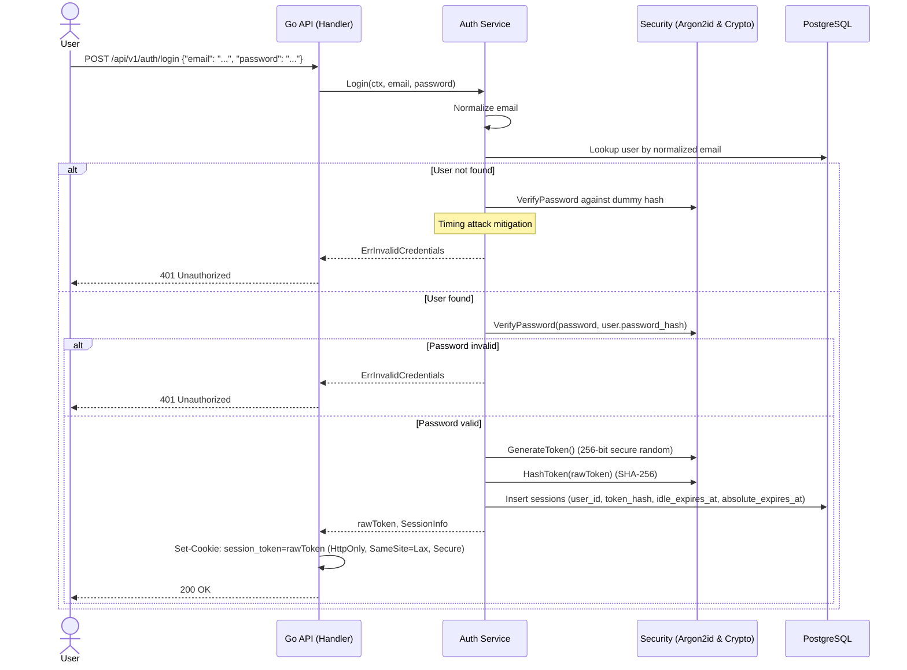
```mermaid
sequenceDiagram
    actor U as User
    participant API as Go API (Handler)
    participant S as Auth Service
    participant SEC as Security (Argon2id & Crypto)
    participant DB as PostgreSQL

    U->>API: POST /api/v1/auth/login {"email": "...", "password": "..."}
    API->>S: Login(ctx, email, password)
    S->>S: Normalize email
    S->>DB: Lookup user by normalized email

    alt User not found
        S->>SEC: VerifyPassword against dummy hash
        Note over S: Timing attack mitigation
        S-->>API: ErrInvalidCredentials
        API-->>U: 401 Unauthorized

    else User found
        S->>SEC: VerifyPassword(password, user.password_hash)
        alt Password invalid
            S-->>API: ErrInvalidCredentials
            API-->>U: 401 Unauthorized
        else Password valid
            S->>SEC: GenerateToken() (256-bit secure random)
            S->>SEC: HashToken(rawToken) (SHA-256)
            S->>DB: Insert sessions (user_id, token_hash, idle_expires_at, absolute_expires_at)
            S-->>API: rawToken, SessionInfo
            API->>API: Set-Cookie: session_token=rawToken (HttpOnly, SameSite=Lax, Secure)
            API-->>U: 200 OK
        end
    end
```

**Design details:**

- Endpoint: `POST /api/v1/auth/login`.
- Timing mitigation: A dummy Argon2id hash is verified when the user is not found to prevent user-enumeration timing attacks.
- Session cookie: `HttpOnly`, `Path=/`, `SameSite=Lax`, `Secure` (env-controlled).
- Lifetimes: Idle timeout of 30 minutes, absolute lifetime of 7 days.

---

### Authenticated Request and Sliding Idle Refresh

Authentication middleware validates the session cookie against PostgreSQL and refreshes idle expiration atomically in a single SQL update.

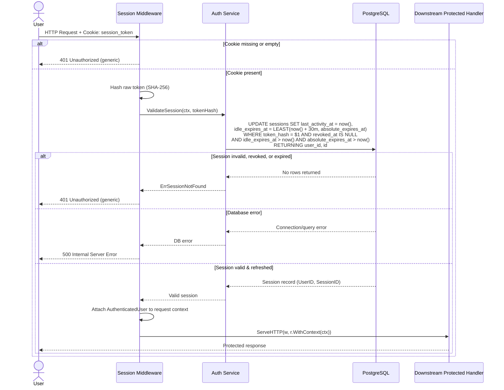
```mermaid
sequenceDiagram
    actor U as User
    participant MW as Session Middleware
    participant S as Auth Service
    participant DB as PostgreSQL
    participant H as Downstream Protected Handler

    U->>MW: HTTP Request + Cookie: session_token
    alt Cookie missing or empty
        MW-->>U: 401 Unauthorized (generic)
    else Cookie present
        MW->>MW: Hash raw token (SHA-256)
        MW->>S: ValidateSession(ctx, tokenHash)
        S->>DB: UPDATE sessions SET last_activity_at = now(),<br/>idle_expires_at = LEAST(now() + 30m, absolute_expires_at)<br/>WHERE token_hash = $1 AND revoked_at IS NULL<br/>AND idle_expires_at > now() AND absolute_expires_at > now()<br/>RETURNING user_id, id

        alt Session invalid, revoked, or expired
            DB-->>S: No rows returned
            S-->>MW: ErrSessionNotFound
            MW-->>U: 401 Unauthorized (generic)

        else Database error
            DB-->>S: Connection/query error
            S-->>MW: DB error
            MW-->>U: 500 Internal Server Error

        else Session valid & refreshed
            DB-->>S: Session record (UserID, SessionID)
            S-->>MW: Valid session
            MW->>MW: Attach AuthenticatedUser to request context
            MW->>H: ServeHTTP(w, r.WithContext(ctx))
            H-->>U: Protected response
        end
    end
```

**Design details:**

- Concurrency & atomicity: Single `UPDATE … RETURNING` query validates non-revocation, idle expiry, and absolute expiry while refreshing `idle_expires_at` clamped to `absolute_expires_at`.
- Privacy: Downstream handlers retrieve `AuthenticatedUser{UserID, SessionID}` via private package context key. Raw tokens are never in context or logs.
- Reliability: Database errors return 500 instead of falsely reporting 401.

---

### Logout and Session Revocation

Authenticated user logs out. The session is revoked in PostgreSQL and the cookie is cleared with matching attributes.

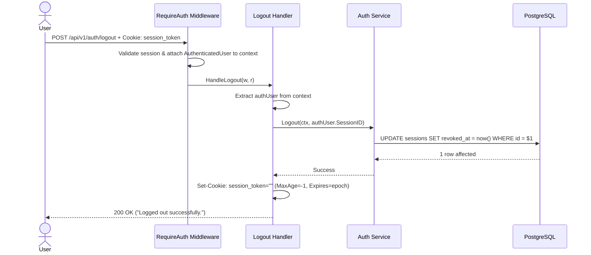
```mermaid
sequenceDiagram
    actor U as User
    participant MW as RequireAuth Middleware
    participant H as Logout Handler
    participant S as Auth Service
    participant DB as PostgreSQL

    U->>MW: POST /api/v1/auth/logout + Cookie: session_token
    MW->>MW: Validate session & attach AuthenticatedUser to context
    MW->>H: HandleLogout(w, r)
    H->>H: Extract authUser from context
    H->>S: Logout(ctx, authUser.SessionID)
    S->>DB: UPDATE sessions SET revoked_at = now() WHERE id = $1
    DB-->>S: 1 row affected
    S-->>H: Success
    H->>H: Set-Cookie: session_token="" (MaxAge=-1, Expires=epoch)
    H-->>U: 200 OK ("Logged out successfully.")
```

**Design details:**

- Endpoint: `POST /api/v1/auth/logout`.
- Soft revocation: Sets `revoked_at = now()`, preventing future requests while preserving the audit trail.
- Cookie clearing: Re-issues cookie with `MaxAge: -1` and `Expires: Unix(0,0)`.

---

## Part 2: Planned Workflows (General-Admission Ticketing Pipeline)

### Create Event and Validate Venue Availability

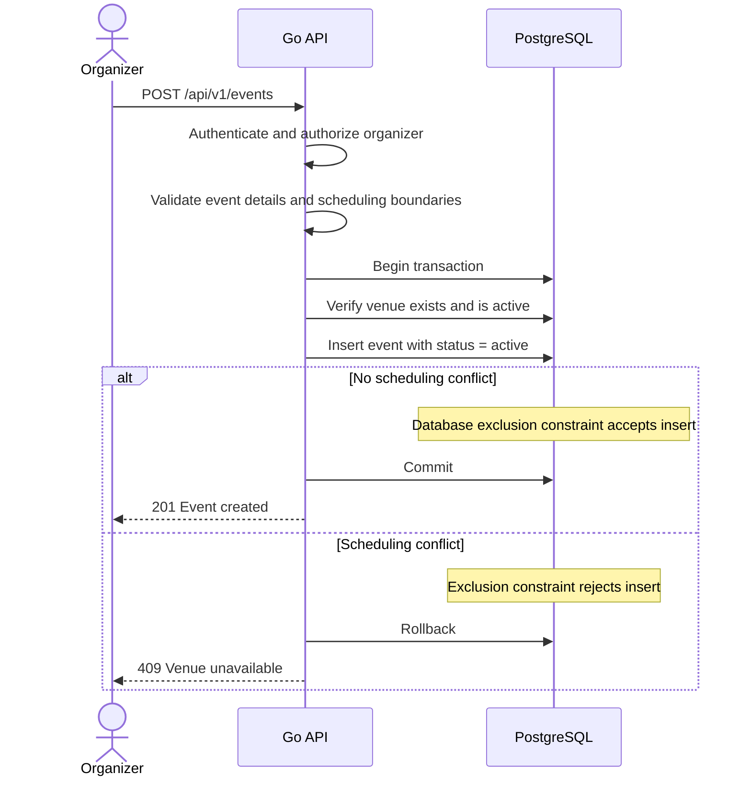
```mermaid
sequenceDiagram
    actor O as Organizer
    participant API as Go API
    participant DB as PostgreSQL

    O->>API: POST /api/v1/events
    API->>API: Authenticate and authorize organizer
    API->>API: Validate event details and scheduling boundaries

    API->>DB: Begin transaction
    API->>DB: Verify venue exists and is active
    API->>DB: Insert event with status = active

    alt No scheduling conflict
        Note over DB: Database exclusion constraint accepts insert
        API->>DB: Commit
        API-->>O: 201 Event created

    else Scheduling conflict
        Note over DB: Exclusion constraint rejects insert
        API->>DB: Rollback
        API-->>O: 409 Venue unavailable
    end
```

---

### Reschedule Event

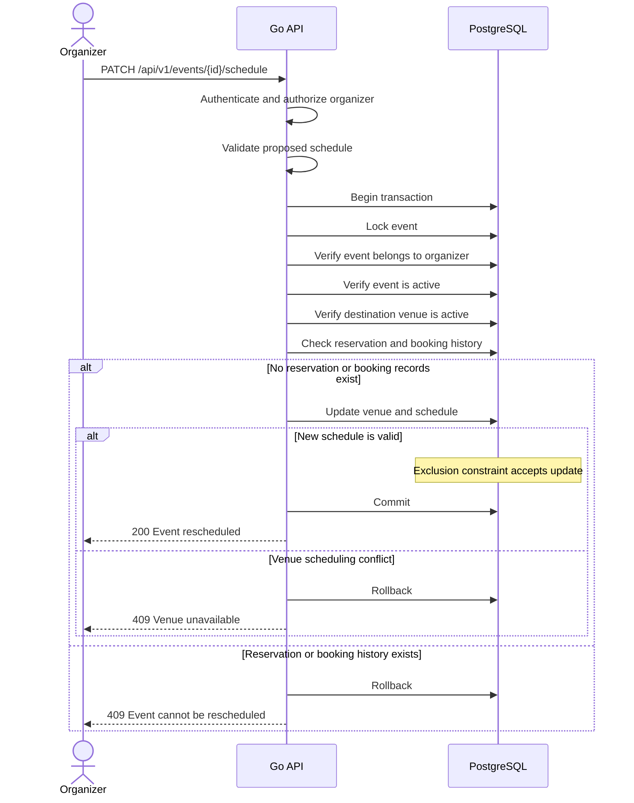
```mermaid
sequenceDiagram
    actor O as Organizer
    participant API as Go API
    participant DB as PostgreSQL

    O->>API: PATCH /api/v1/events/{id}/schedule
    API->>API: Authenticate and authorize organizer
    API->>API: Validate proposed schedule

    API->>DB: Begin transaction
    API->>DB: Lock event
    API->>DB: Verify event belongs to organizer
    API->>DB: Verify event is active
    API->>DB: Verify destination venue is active
    API->>DB: Check reservation and booking history

    alt No reservation or booking records exist
        API->>DB: Update venue and schedule

        alt New schedule is valid
            Note over DB: Exclusion constraint accepts update
            API->>DB: Commit
            API-->>O: 200 Event rescheduled

        else Venue scheduling conflict
            API->>DB: Rollback
            API-->>O: 409 Venue unavailable
        end

    else Reservation or booking history exists
        API->>DB: Rollback
        API-->>O: 409 Event cannot be rescheduled
    end
```

---

### Change Booking Availability

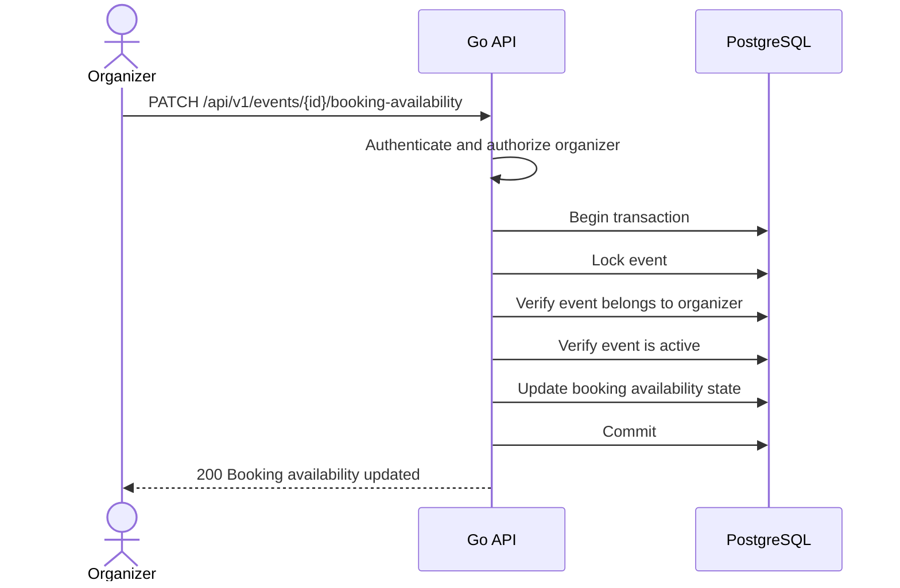
```mermaid
sequenceDiagram
    actor O as Organizer
    participant API as Go API
    participant DB as PostgreSQL

    O->>API: PATCH /api/v1/events/{id}/booking-availability
    API->>API: Authenticate and authorize organizer

    API->>DB: Begin transaction
    API->>DB: Lock event
    API->>DB: Verify event belongs to organizer
    API->>DB: Verify event is active
    API->>DB: Update booking availability state
    API->>DB: Commit

    API-->>O: 200 Booking availability updated
```

---

### Reserve Tickets

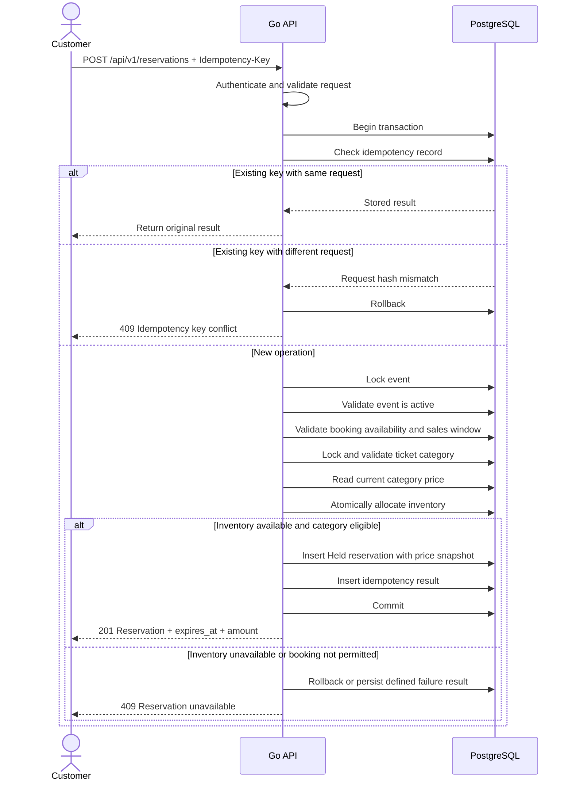
```mermaid
sequenceDiagram
    actor C as Customer
    participant API as Go API
    participant DB as PostgreSQL

    C->>API: POST /api/v1/reservations + Idempotency-Key

    API->>API: Authenticate and validate request

    API->>DB: Begin transaction
    API->>DB: Check idempotency record

    alt Existing key with same request
        DB-->>API: Stored result
        API-->>C: Return original result

    else Existing key with different request
        DB-->>API: Request hash mismatch
        API->>DB: Rollback
        API-->>C: 409 Idempotency key conflict

    else New operation
        API->>DB: Lock event
        API->>DB: Validate event is active
        API->>DB: Validate booking availability and sales window
        API->>DB: Lock and validate ticket category
        API->>DB: Read current category price
        API->>DB: Atomically allocate inventory

        alt Inventory available and category eligible
            API->>DB: Insert Held reservation with price snapshot
            API->>DB: Insert idempotency result
            API->>DB: Commit

            API-->>C: 201 Reservation + expires_at + amount

        else Inventory unavailable or booking not permitted
            API->>DB: Rollback or persist defined failure result
            API-->>C: 409 Reservation unavailable
        end
    end
```

---

### Confirm Reservation

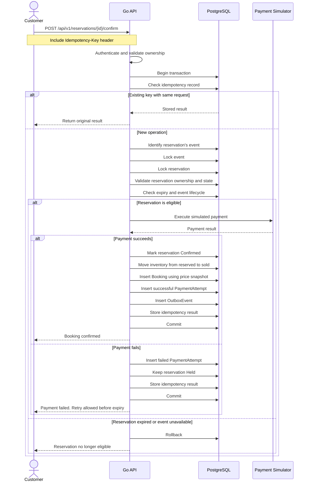
```mermaid
sequenceDiagram
    actor C as Customer
    participant API as Go API
    participant DB as PostgreSQL
    participant Pay as Payment Simulator

    C->>API: POST /api/v1/reservations/{id}/confirm
    Note over C,API: Include Idempotency-Key header

    API->>API: Authenticate and validate ownership

    API->>DB: Begin transaction
    API->>DB: Check idempotency record

    alt Existing key with same request
        DB-->>API: Stored result
        API-->>C: Return original result

    else New operation
        API->>DB: Identify reservation's event
        API->>DB: Lock event
        API->>DB: Lock reservation
        API->>DB: Validate reservation ownership and state
        API->>DB: Check expiry and event lifecycle

        alt Reservation is eligible
            API->>Pay: Execute simulated payment
            Pay-->>API: Payment result

            alt Payment succeeds
                API->>DB: Mark reservation Confirmed
                API->>DB: Move inventory from reserved to sold
                API->>DB: Insert Booking using price snapshot
                API->>DB: Insert successful PaymentAttempt
                API->>DB: Insert OutboxEvent
                API->>DB: Store idempotency result
                API->>DB: Commit

                API-->>C: Booking confirmed

            else Payment fails
                API->>DB: Insert failed PaymentAttempt
                API->>DB: Keep reservation Held
                API->>DB: Store idempotency result
                API->>DB: Commit

                API-->>C: Payment failed. Retry allowed before expiry
            end

        else Reservation expired or event unavailable
            API->>DB: Rollback
            API-->>C: Reservation no longer eligible
        end
    end
```

---

### Expire Reservations

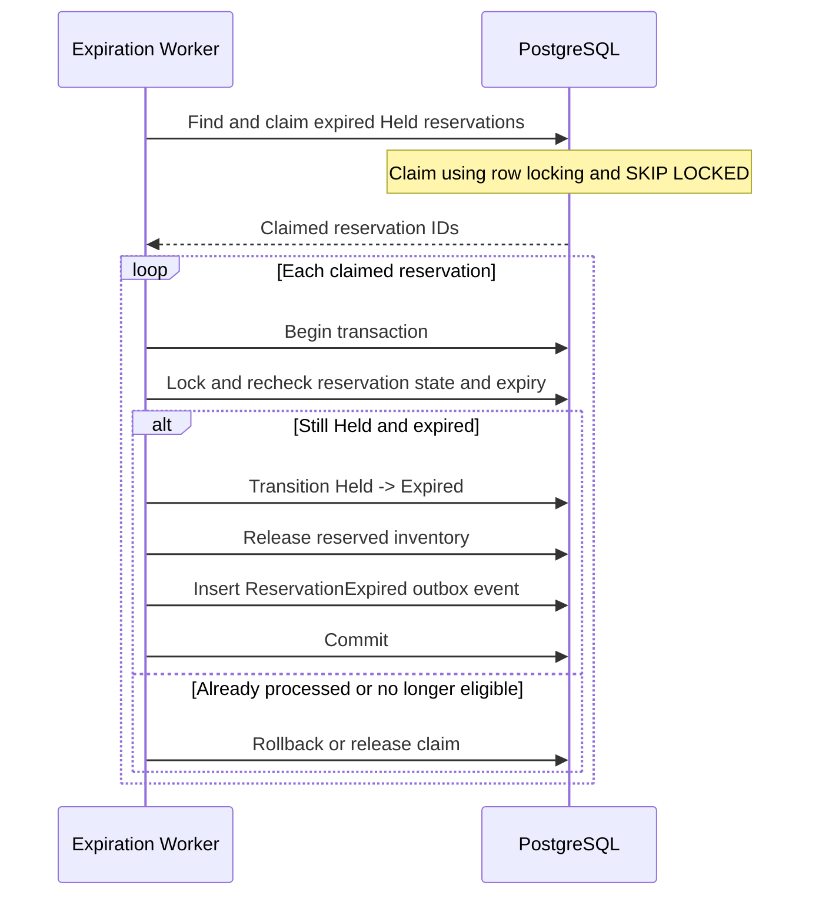
```mermaid
sequenceDiagram
    participant W as Expiration Worker
    participant DB as PostgreSQL

    W->>DB: Find and claim expired Held reservations
    Note over DB: Claim using row locking and SKIP LOCKED
    DB-->>W: Claimed reservation IDs

    loop Each claimed reservation
        W->>DB: Begin transaction
        W->>DB: Lock and recheck reservation state and expiry

        alt Still Held and expired
            W->>DB: Transition Held -> Expired
            W->>DB: Release reserved inventory
            W->>DB: Insert ReservationExpired outbox event
            W->>DB: Commit

        else Already processed or no longer eligible
            W->>DB: Rollback or release claim
        end
    end
```

---

### Cancel Reservation

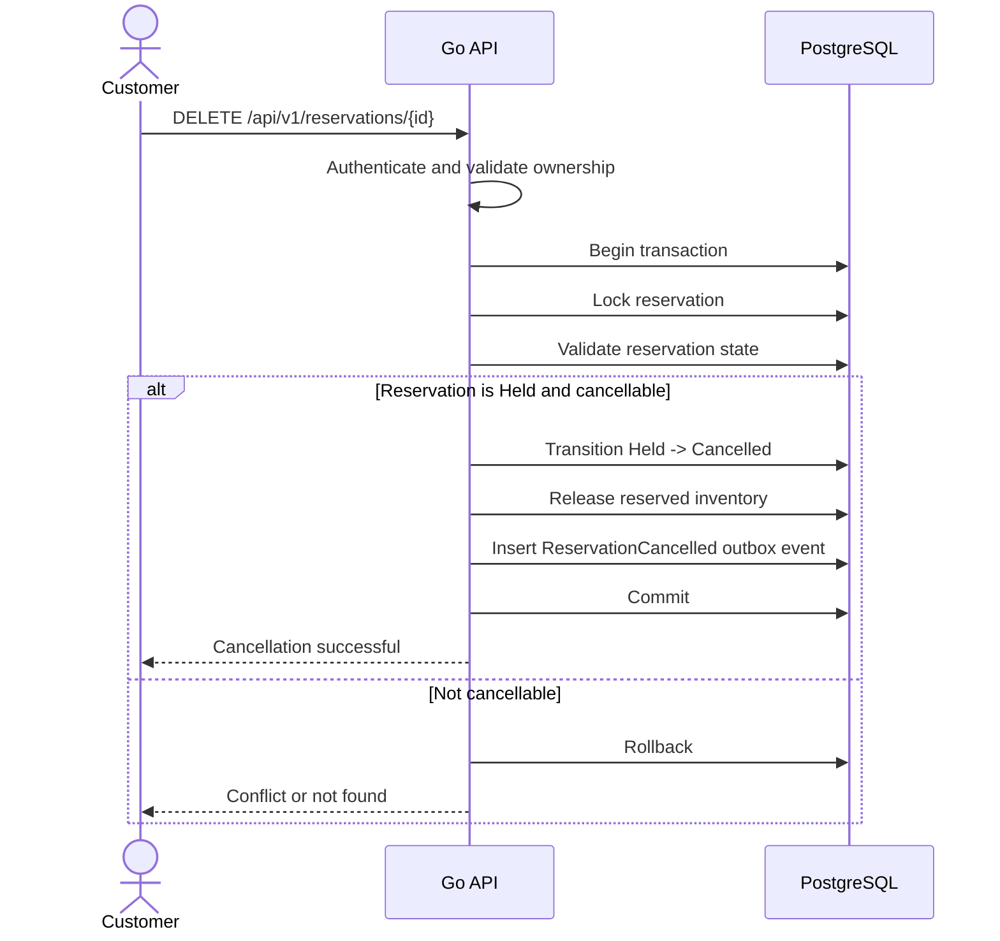
```mermaid
sequenceDiagram
    actor C as Customer
    participant API as Go API
    participant DB as PostgreSQL

    C->>API: DELETE /api/v1/reservations/{id}

    API->>API: Authenticate and validate ownership

    API->>DB: Begin transaction
    API->>DB: Lock reservation
    API->>DB: Validate reservation state

    alt Reservation is Held and cancellable
        API->>DB: Transition Held -> Cancelled
        API->>DB: Release reserved inventory
        API->>DB: Insert ReservationCancelled outbox event
        API->>DB: Commit

        API-->>C: Cancellation successful

    else Not cancellable
        API->>DB: Rollback
        API-->>C: Conflict or not found
    end
```

---

### Cancel Event and Initiate Refunds

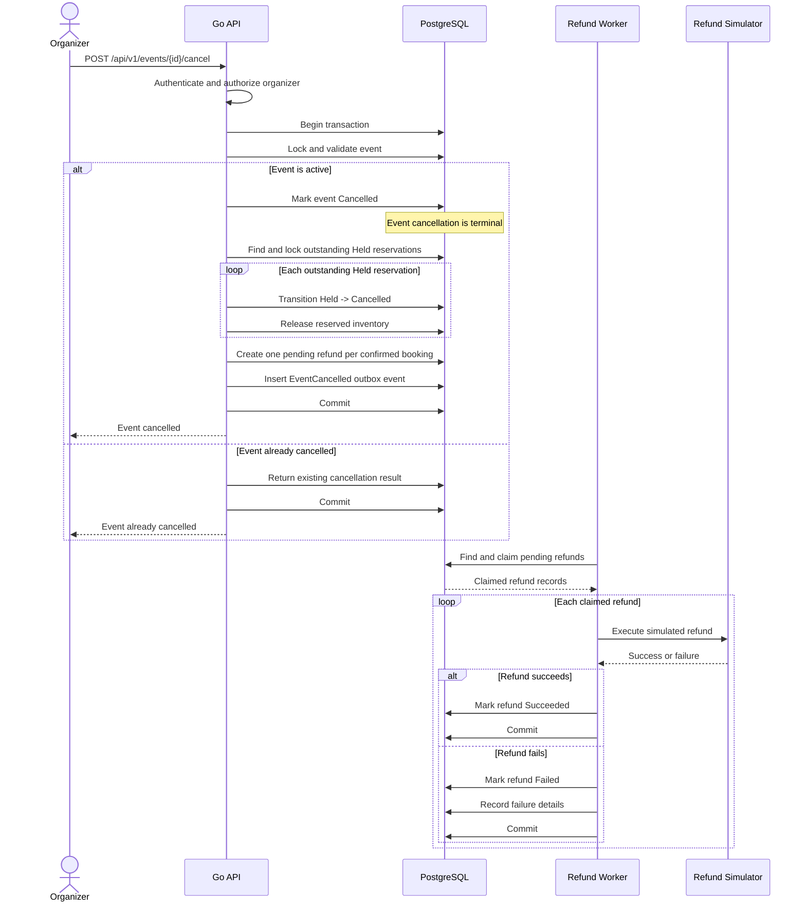
```mermaid
sequenceDiagram
    actor O as Organizer
    participant API as Go API
    participant DB as PostgreSQL
    participant W as Refund Worker
    participant R as Refund Simulator

    O->>API: POST /api/v1/events/{id}/cancel

    API->>API: Authenticate and authorize organizer
    API->>DB: Begin transaction
    API->>DB: Lock and validate event

    alt Event is active
        API->>DB: Mark event Cancelled
        Note over DB: Event cancellation is terminal

        API->>DB: Find and lock outstanding Held reservations
        loop Each outstanding Held reservation
            API->>DB: Transition Held -> Cancelled
            API->>DB: Release reserved inventory
        end

        API->>DB: Create one pending refund per confirmed booking
        API->>DB: Insert EventCancelled outbox event
        API->>DB: Commit

        API-->>O: Event cancelled

    else Event already cancelled
        API->>DB: Return existing cancellation result
        API->>DB: Commit
        API-->>O: Event already cancelled
    end

    W->>DB: Find and claim pending refunds
    DB-->>W: Claimed refund records

    loop Each claimed refund
        W->>R: Execute simulated refund
        R-->>W: Success or failure

        alt Refund succeeds
            W->>DB: Mark refund Succeeded
            W->>DB: Commit
        else Refund fails
            W->>DB: Mark refund Failed
            W->>DB: Record failure details
            W->>DB: Commit
        end
    end
```

---

### Publish Outbox Events to Message Broker (Planned External Transport)

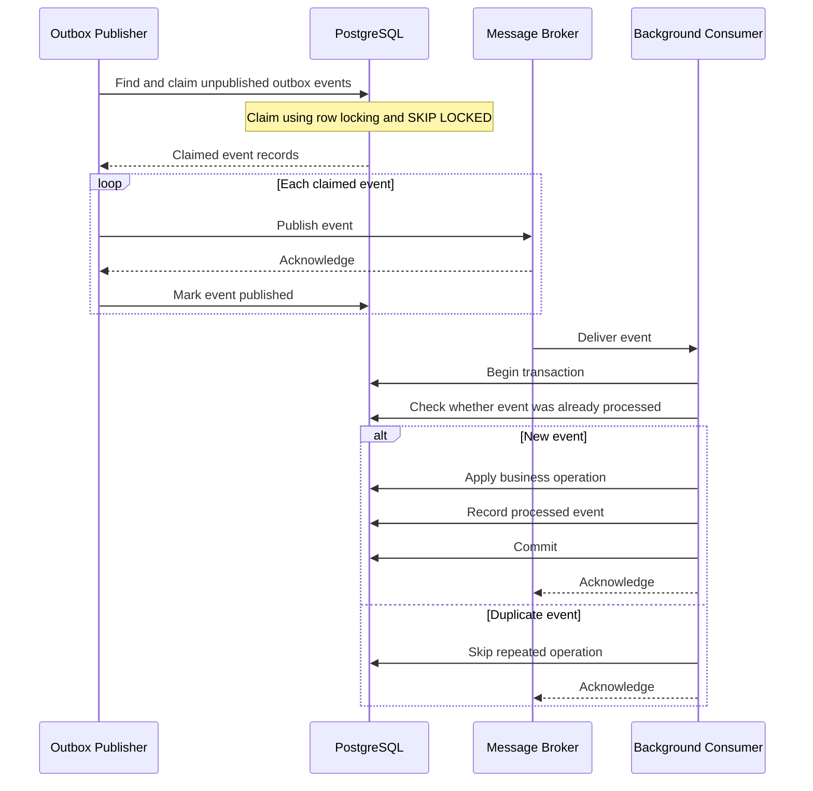
```mermaid
sequenceDiagram
    participant W as Outbox Publisher
    participant DB as PostgreSQL
    participant B as Message Broker
    participant Consumer as Background Consumer

    W->>DB: Find and claim unpublished outbox events
    Note over DB: Claim using row locking and SKIP LOCKED
    DB-->>W: Claimed event records

    loop Each claimed event
        W->>B: Publish event
        B-->>W: Acknowledge

        W->>DB: Mark event published
    end

    B->>Consumer: Deliver event
    Consumer->>DB: Begin transaction
    Consumer->>DB: Check whether event was already processed

    alt New event
        Consumer->>DB: Apply business operation
        Consumer->>DB: Record processed event
        Consumer->>DB: Commit
        Consumer-->>B: Acknowledge

    else Duplicate event
        Consumer->>DB: Skip repeated operation
        Consumer-->>B: Acknowledge
    end
```
